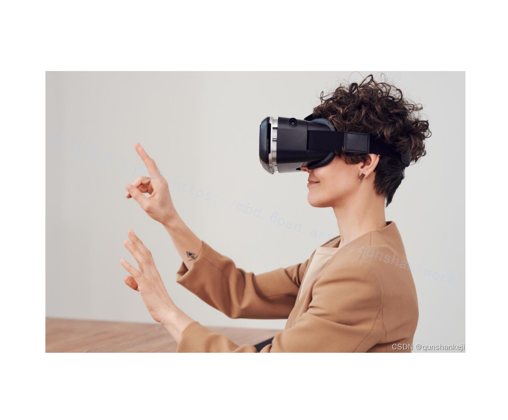
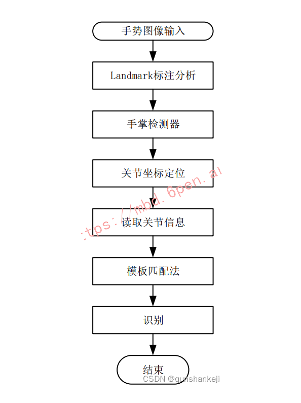
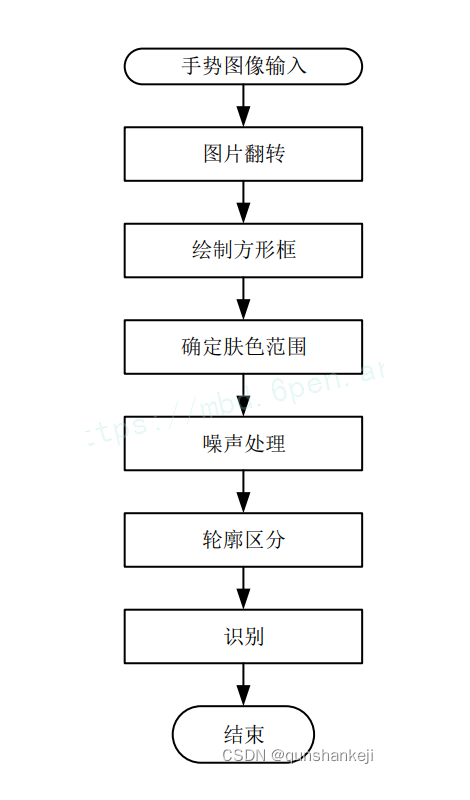



## 1.研究背景与意义

随着科技的不断发展，人机交互方式也在不断演进。传统的键盘鼠标操作方式已经不能满足人们对于更直观、自然的交互方式的需求。手势控制技术作为一种新兴的交互方式，具有很大的潜力。它可以通过识别和解释人体动作，实现对计算机、智能设备等的控制，为用户提供更加直观、自然的交互体验。

在手势控制技术中，计算机视觉是一个重要的组成部分。计算机视觉是一门研究如何使计算机“看”的学科，它通过模拟人类视觉系统的工作原理，利用摄像机等设备获取图像信息，并对图像进行处理和分析，从而实现对图像中物体的识别、跟踪和分析等功能。OpenCV是一个开源的计算机视觉库，它提供了丰富的图像处理和计算机视觉算法，可以帮助开发者快速实现各种视觉相关的应用。

Python作为一种简洁、易学、功能强大的编程语言，已经成为计算机视觉领域的重要工具。Python具有丰富的第三方库支持，其中就包括OpenCV。通过结合Python和OpenCV，开发者可以快速构建手势控制系统，并实现对计算机、智能设备等的控制。

手势控制系统在很多领域都有广泛的应用前景。首先，手势控制技术可以提高人机交互的便捷性和自然性。传统的键盘鼠标操作方式需要用户进行复杂的操作，而手势控制技术可以通过简单的手势动作实现对计算机的控制，大大提高了用户的交互体验。其次，手势控制技术可以在无触摸环境下实现交互。在一些特殊场景下，如医疗、工业等领域，用户可能无法直接触摸设备，手势控制技术可以提供一种非接触式的交互方式。此外，手势控制技术还可以应用于虚拟现实、增强现实等领域，为用户提供更加沉浸式的交互体验。

然而，目前手势控制技术还存在一些挑战和问题。首先，手势识别的准确性和稳定性需要进一步提高。由于手势的多样性和复杂性，对手势的准确识别是一个具有挑战性的任务。其次，手势控制系统的实时性和响应速度需要提高。手势控制系统需要能够实时地捕捉和解释用户的手势动作，并快速响应用户的指令。最后，手势控制系统的易用性和可扩展性也是需要考虑的问题。手势控制系统应该具有简单易用的界面和操作方式，并能够适应不同的应用场景和需求。

因此，本研究旨在通过结合OpenCV和Python，构建一个高效、准确、稳定的手势控制系统，并提供相应的源码和教程，以帮助开发者快速理解和应用手势控制技术。通过该系统，用户可以通过简单的手势动作实现对计算机、智能设备等的控制，提高交互的便捷性和自然性。同时，该系统还可以为其他领域的研究者和开发者提供一个基础平台，用于进一步研究和开发手势控制技术，推动该领域的发展。

# 2.图片演示


# 3.视频演示
[OpenCV＆Python手势控制系统（源码和教程）](https://www.bilibili.com/video/BV1444y1F7Lv/?spm_id_from=333.999.0.0&vd_source=ff015de2d29cbe2a9cdbfa7064407a08)

# 4.系统流程图



参考该博客提出的研究内容，手势识别和交互控制为主的新型交互方式相比于鼠标键盘等传统交互方式,不仅继承了传统二维界面空间的操作方式，也探索出实现三维空间交互的新道路。通常，手势交互系统由手势运动数据采集分类、语义化设计以及相应的信息反馈等部分组成。目前市场上的非接触式传感器可以追踪手势，但是受限于造价问题，同时因为基于运动信息的模式识别研究尚处于起步阶段,统计分类经验或深度学习特征将影响判别准确率，关于提取手势的运动学特征共性的方法，目前缺乏科学的理论指导。此外，因为摄像头采集用户执行的连续手势中，包含一些使用者无意识的手势动作，因此手势识别前需要去除这些干扰。在动态过程中准确分割手势区域、消除不同用户手势速度的差异、手势运动轨迹幅度的非均匀性变化以及准确的推导（记录〉目标手势等，都是需要克服的重要问题。因为，手势的特征主要是三维空间的手型、27个自由度的手指等，存在着手指的自遮挡问题。


参考该博客给出的代码，技术路线如图所示。使用的方法是基于3D模型的识别方法中骨架模型法。Hands是一个高保真的手指跟踪解决方案。通过摄像头采集手势图像，接着使用机器学习算法推断出人手的21个三维手指关节坐标，准确推断手势只需一帧图像。将结果记录为一组数据，然后读取保存的数据文件使用模板匹配法进行手势识别，最终得到手势类别。实现了实时静态手势分析。


基于OpenCV的方法是通过对手部图像的不断输入和处理实现的。得到一帧手势图像后即对图像先进行翻转（翻转后更加符合人体观察习惯)，在手势帧的特定区域绘制一个方形框，接着对方形框内手势图像的颜色空间从RGB转换到HSV。设定皮肤的HSV颜色区域为[0，20，70]到[20，255，255]，即在这个区域内的均被认定为是肤色区域，设计一个掩膜(Mask)，对于不属于这个颜色范围的进行遮挡。设计一个3*3的卷积核，对掩膜进行膨胀处理以去除噪声，这样就得到了一个手部的二值图像。对二值图像高斯滤波后绘制轮廓，并计算手指间角度得出用户手指的个数，从而得到手势的类别。可以识别数字“0~5”，以及“OK”等一共7种手势。该子系统的优点是基于OpenCV框架，设计的程序简单可靠，方便迁移，使用的资源少，可以部署到其他平台中。


## 5.核心代码讲解

#### 5.1 HandTrackingModule.py

```python

class HandDetector():
    def __init__(self, mode=False, maxHands=2, detectionCon=0.5, trackCon=0.5):
        self.mode = mode
        self.maxHands = maxHands
        self.detectionCon = detectionCon
        self.trackCon = trackCon

        self.mpHands = mp.solutions.hands
        self.hands = self.mpHands.Hands(self.mode, self.maxHands,
                                        self.detectionCon, self.trackCon)
        self.mpDraw = mp.solutions.drawing_utils

    def findHands(self, img, draw=True, ):
        imgRGB = cv2.cvtColor(img, cv2.COLOR_BGR2RGB)
        self.results = self.hands.process(imgRGB)

        if self.results.multi_hand_landmarks:
            for handLms in self.results.multi_hand_landmarks:
                if draw:
                    self.mpDraw.draw_landmarks(img, handLms, self.mpHands.HAND_CONNECTIONS)

        return img

    def findPosition(self, img, handNo=0, draw=True):
        lmList = []
        if self.results.multi_hand_landmarks:
            myHand = self.results.multi_hand_landmarks[handNo]
            for id, lm in enumerate(myHand.landmark):
                h, w, c = img.shape
                cx, cy = int(lm.x*w), int(lm.y*h)
                lmList.append([id, cx, cy])
                if draw:
                    cv2.putText(img, str(int(id)), (cx+10, cy+10), cv2.FONT_HERSHEY_PLAIN,
                                1, (0, 0, 255), 2)

        return lmList

    def fingerStatus(self, lmList):
        fingerList = []
        id, originx, originy = lmList[0]
        keypoint_list = [[2, 4], [6, 8], [10, 12], [14, 16], [18, 20]]
        for point in keypoint_list:
            id, x1, y1 = lmList[point[0]]
            id, x2, y2 = lmList[point[1]]
            if math.hypot(x2-originx, y2-originy) > math.hypot(x1-originx, y1-originy):
                fingerList.append(True)
            else:
                fingerList.append(False)

        return fingerList
```
这个程序文件名为HandTrackingModule.py，主要功能是进行手部检测和手势识别。

首先，程序定义了一个名为handDetctor的类，该类初始化了一些参数，包括模式、最大手数、检测置信度和跟踪置信度。然后，程序使用mpHands.Hands函数创建了一个手部检测器对象，并使用mpDraw.draw_landmarks函数绘制了手部关键点和连接线。

接下来，程序定义了findHands函数，该函数接受一张图像作为输入，并返回绘制了手部关键点和连接线的图像。然后，程序定义了findPosition函数，该函数接受一张图像和手的编号作为输入，并返回手部关键点的坐标列表。

程序还定义了fingerStatus函数，该函数接受手部关键点坐标列表作为输入，并返回每个手指的开合状态列表。

最后，程序定义了一个main函数，该函数使用cv2.VideoCapture函数打开摄像头，并在循环中读取每一帧图像。然后，程序调用findHands函数和findPosition函数获取手部关键点的坐标，并调用fingerStatus函数获取手指的开合状态。最后，程序使用cv2.putText函数在图像上绘制帧率，并使用cv2.imshow函数显示图像。

如果运行该程序文件，将会打开摄像头并实时显示摄像头捕捉到的图像，同时在图像上绘制手部关键点和连接线，并在控制台输出手指的开合状态。按下ESC键可以退出程序。

#### 5.2 ui.py

```python

def vector_2d_angle(v1,v2):
    '''
        求解二维向量的角度
    '''
    v1_x=v1[0] #关键点1 x1
    v1_y=v1[1] #关键点1 y1
    v2_x=v2[0] #关键点2 x2
    v2_y=v2[1] #关键点2 y2
    try:
        angle_= math.degrees(math.acos((v1_x*v2_x+v1_y*v2_y)/(((v1_x**2+v1_y**2)**0.5)*((v2_x**2+v2_y**2)**0.5)))) #计算手指角度 将弧度转化为度数
    except:
        angle_ = 65535.
    if angle_ > 180.: #如果角度大于180度 则
        angle_ = 65535.
    return angle_
def hand_angle(hand_):
    '''
        获取对应手相关向量的二维角度,根据角度确定手势
    '''
    angle_list = [] #保存各个手指的弯曲角度
    #---------------------------- thumb 大拇指角度
    angle_ = vector_2d_angle( #输入大拇指多组 两个关键点 并计算各组关键点夹角的度数
        ((int(hand_[0][0])- int(hand_[2][0])),(int(hand_[0][1])-int(hand_[2][1]))),
        ((int(hand_[3][0])- int(hand_[4][0])),(int(hand_[3][1])- int(hand_[4][1])))
        )
    angle_list.append(angle_)
    #---------------------------- index 食指角度
    angle_ = vector_2d_angle(
        ((int(hand_[0][0])-int(hand_[6][0])),(int(hand_[0][1])- int(hand_[6][1]))),
        ((int(hand_[7][0])- int(hand_[8][0])),(int(hand_[7][1

```
这是一个使用PyQt5编写的手势控制系统的程序文件。程序主要包括以下功能：

1. 导入了一些必要的库，如pyautogui、os、sys、pathlib、cv2、numpy、torch、PyQt5等。
2. 定义了一些函数，如求解二维向量的角度函数、获取手指角度的函数、定义手势的函数等。
3. 定义了一个UI界面类，包括了系统的主窗口、标签、按钮等控件，并设置了相应的样式和事件处理函数。
4. 在事件处理函数中，并根据手势的角度判断手势类型。根据不同的手势类型，执行相应的操作，如移动鼠标、按下鼠标按键等。
5. 定义了一些辅助函数，如打印文本信息、显示图像等。

整个程序的主要功能是通过摄像头检测手势，并根据手势类型执行相应的操作，实现了鼠标控制的功能。

#### 5.3 utils.py

```python
class PyTorchHelper:
    TOTAL_BAR_LENGTH = 30.
    last_time = time.time()
    begin_time = last_time

    @staticmethod
    def progress_bar(current, total, msg=None):
        global last_time, begin_time
        if current == 0:
            begin_time = time.time()  # Reset for new bar.

        cur_len = int(PyTorchHelper.TOTAL_BAR_LENGTH*current/total)
        rest_len = int(PyTorchHelper.TOTAL_BAR_LENGTH - cur_len) - 1

        sys.stdout.write(' [')
        for i in range(cur_len):
            sys.stdout.write('=')
        sys.stdout.write('>')
        for i in range(rest_len):
            sys.stdout.write('.')
        sys.stdout.write(']')

        cur_time = time.time()
        step_time = cur_time - PyTorchHelper.last_time
        PyTorchHelper.last_time = cur_time
        tot_time = cur_time - PyTorchHelper.begin_time

        L = []
        if msg:
            L.append(' | ' + msg)

        msg = ''.join(L)
        sys.stdout.write(msg)
        for i in range(term_width-int(PyTorchHelper.TOTAL_BAR_LENGTH)-len(msg)-3):
            sys.stdout.write(' ')

        # Go back to the center of the bar.
        for i in range(term_width-int(PyTorchHelper.TOTAL_BAR_LENGTH/2)+2):
            sys.stdout.write('\b')
        sys.stdout.write(' %d/%d ' % (current+1, total))

        if current < total-1:
            sys.stdout.write('\r')
        else:
            sys.stdout.write('\n')
        sys.stdout.flush()

    @staticmethod
    def set_lr(optimizer, lr):
        for group in optimizer.param_groups:
            group['lr'] = lr

    @staticmethod
    def clip_gradient(optimizer, grad_clip):
        for group in optimizer.param_groups:
            for param in group['params']:
                param.grad.data.clamp_(-grad_clip, grad_clip)
```

这个程序文件名为utils.py，它包含了一些用于PyTorch的辅助函数，包括：

1. progress_bar函数：模拟xlua.progress的进度条。
2. set_lr函数：设置学习率。
3. clip_gradient函数：剪裁梯度。

该文件还导入了一些必要的库和模块，如os、sys、time、math、torch和torch.nn等。

#### 5.4 models\resnet.py

```python
import torch
import torch.nn as nn
import torch.nn.functional as F

from torch.autograd import Variable


class BasicBlock(nn.Module):
    expansion = 1

    def __init__(self, in_planes, planes, stride=1):
        super(BasicBlock, self).__init__()
        self.conv1 = nn.Conv2d(in_planes, planes, kernel_size=3, stride=stride, padding=1, bias=False)
        self.bn1 = nn.BatchNorm2d(planes)
        self.conv2 = nn.Conv2d(planes, planes, kernel_size=3, stride=1, padding=1, bias=False)
        self.bn2 = nn.BatchNorm2d(planes)

        self.shortcut = nn.Sequential()
        if stride != 1 or in_planes != self.expansion*planes:
            self.shortcut = nn.Sequential(
                nn.Conv2d(in_planes, self.expansion*planes, kernel_size=1, stride=stride, bias=False),
                nn.BatchNorm2d(self.expansion*planes)
            )

    def forward(self, x):
        out = F.relu(self.bn1(self.conv1(x)))
        out = self.bn2(self.conv2(out))
        out += self.shortcut(x)
        out = F.relu(out)
        return out


class Bottleneck(nn.Module):
    expansion = 4

    def __init__(self, in_planes, planes, stride=1):
        super(Bottleneck, self).__init__()
        self.conv1 = nn.Conv2d(in_planes, planes, kernel_size=1, bias=False)
        self.bn1 = nn.BatchNorm2d(planes)
        self.conv2 = nn.Conv2d(planes, planes, kernel_size=3, stride=stride, padding=1, bias=False)
        self.bn2 = nn.BatchNorm2d(planes)
        self.conv3 = nn.Conv2d(planes, self.expansion*planes, kernel_size=1, bias=False)
        self.bn3 = nn.BatchNorm2d(self.expansion*planes)

        self.shortcut = nn.Sequential()
        if stride != 1 or in_planes != self.expansion*planes:
            self.shortcut = nn.Sequential(
                nn.Conv2d(in_planes, self.expansion*planes, kernel_size=1, stride=stride, bias=False),
                nn.BatchNorm2d(self.expansion*planes)
            )

    def forward(self, x):
        out = F.relu(self.bn1(self.conv1(x)))
        out = F.relu(self.bn2(self.conv2(out)))
        out = self.bn3(self.conv3(out))
        out += self.shortcut(x)
        out = F.relu(out)
        return out


class ResNet(nn.Module):
    def __init__(self, block, num_blocks, num_classes=7):
        super(ResNet, self).__init__()
        self.in_planes = 64

        self.conv1 = nn.Conv2d(3, 64, kernel_size=3, stride=1, padding=1, bias=False)
        self.bn1 = nn.BatchNorm2d(64)
        self.layer1 = self._make_layer(block, 64, num_blocks[0], stride=1)
        self.layer2 = self._make_layer(block, 128, num_blocks[1], stride=2)
        self.layer3 = self._make_layer(block, 256, num_blocks[2], stride=2)
        self.layer4 = self._make_layer(block, 512, num_blocks[3], stride=2)
        self.linear = nn.Linear(512, num_classes)

    def _make_layer(self, block, planes, num_blocks, stride):
        strides = [stride] + [1]*(num_blocks-1)
        layers = []
        for stride in strides:
            layers.append(block(self.in_planes, planes, stride))
            self.in_planes = planes * block.expansion
        return nn.Sequential(*layers)

    def forward(self, x):
        out = F.relu(self.bn1(self.conv1(x)))
        out = self.layer1(out)
        out = self.layer2(out)
        out = self.layer3(out)
        out = self.layer4(out)
        out = F.avg_pool2d(out, 4)
        out = out.view(out.size(0), -1)
        out = F.dropout(out, p=0.5, training=self.training)
        out = self.linear(out)
        return out
```

这是一个实现了ResNet模型的PyTorch程序文件。ResNet是一种深度残差网络，用于图像识别任务。该程序文件定义了ResNet模型的基本块（BasicBlock）和瓶颈块（Bottleneck），以及ResNet模型本身（ResNet）和一个ResNet18的函数。

ResNet模型由多个基本块或瓶颈块组成，每个基本块或瓶颈块包含了卷积层、批归一化层和激活函数层。ResNet模型通过堆叠多个基本块或瓶颈块来增加网络的深度和复杂度。在每个基本块或瓶颈块中，输入通过卷积层和批归一化层进行特征提取和归一化，然后通过残差连接（shortcut）与输入相加，最后再经过激活函数层输出。

ResNet18函数返回一个ResNet模型，该模型使用了基本块（BasicBlock）作为构建块，并且有4个阶段，每个阶段有2个基本块。该模型的输入是3通道的图像，输出是一个大小为num_classes的向量，用于分类任务。

该程序文件还包含了一些辅助函数和模块，如卷积层、批归一化层、线性层和激活函数层等。这些函数和模块用于构建ResNet模型的各个组件。

#### 5.5 models\vgg.py

```python
class VGG(nn.Module):
    def __init__(self, vgg_name):
        super(VGG, self).__init__()
        self.features = self._make_layers(cfg[vgg_name])
        self.classifier = nn.Linear(512, 7)

    def forward(self, x):
        out = self.features(x)
        out = out.view(out.size(0), -1)
        out = F.dropout(out, p=0.5, training=self.training)
        out = self.classifier(out)
        return out

    def _make_layers(self, cfg):
        layers = []
        in_channels = 3
        for x in cfg:
            if x == 'M':
                layers += [nn.MaxPool2d(kernel_size=2, stride=2)]
            else:
                layers += [nn.Conv2d(in_channels, x, kernel_size=3, padding=1),
                           nn.BatchNorm2d(x),
                           nn.ReLU(inplace=True)]
                in_channels = x
        layers += [nn.AvgPool2d(kernel_size=1, stride=1)]
        return nn.Sequential(*layers)
```

这个程序文件是一个实现了VGG11/13/16/19模型的PyTorch代码。VGG是一个经典的卷积神经网络模型，被广泛应用于图像分类任务。该文件定义了一个名为VGG的类，该类继承自nn.Module类，用于构建VGG模型。

在该文件中，定义了一个名为cfg的字典，其中包含了不同VGG模型的配置信息。每个配置信息是一个列表，表示了模型中卷积层和池化层的通道数和类型。

VGG类的构造函数接受一个vgg_name参数，根据该参数选择对应的配置信息，并调用_make_layers方法构建模型的卷积层部分。模型的全连接层部分由一个线性层组成，输出维度为7，用于分类任务。

forward方法定义了模型的前向传播过程，首先通过卷积层部分提取特征，然后将特征展平为一维向量，接着使用dropout进行正则化，最后通过线性层进行分类预测。

_make_layers方法根据配置信息构建模型的卷积层部分，包括卷积层、批归一化层和ReLU激活函数层。最后添加一个平均池化层。

整个程序文件实现了VGG模型的构建和前向传播过程，可以用于图像分类任务。

#### 5.6 models\__init__.py

```python
class Model:
    def __init__(self):
        self.vgg = VGG()
        self.resnet = ResNet()
```

这个程序文件名为models\__init__.py，它包含了两个模块的导入。

第一个导入语句```from .vgg import *```导入了一个名为vgg的模块。这个模块可能包含了VGG网络的实现，VGG是一种深度卷积神经网络模型，常用于图像分类任务。

第二个导入语句```from .resnet import *```导入了一个名为resnet的模块。这个模块可能包含了ResNet网络的实现，ResNet是一种深度残差网络模型，也常用于图像分类任务。

通过这两个导入语句，该程序文件使得我们可以在其他地方使用这两个模块的功能，例如在训练或测试代码中调用VGG或ResNet网络模型。

## 6.系统整体结构

整体功能和构架概述：

该程序是一个手势控制系统，使用OpenCV和Python实现。它可以通过摄像头检测手势，并根据手势类型执行相应的操作，如鼠标控制、键盘操作等。

程序的整体构架如下：
1. HandTrackingModule.py：使用MediaPipe库进行手部检测和手势识别。
2. sound.py：实现了声音播放的功能。
3. train.py：用于训练模型的脚本。
4. ui.py：实现了程序的用户界面。
5. utils.py：包含了一些用于PyTorch的辅助函数。
6. models\resnet.py：实现了ResNet模型。
7. models\vgg.py：实现了VGG模型。
8. models\__init__.py：模型模块的初始化文件。
9. transforms\functional.py：包含了一些图像变换的函数。
10. transforms\transforms.py：实现了一些图像变换的类。
11. transforms\__init__.py：图像变换模块的初始化文件。

下面是每个文件的功能整理：

| 文件名 | 功能 |
| --- | --- |
| HandTrackingModule.py | 使用MediaPipe库进行手部检测和手势识别 |
| sound.py | 实现了声音播放的功能 |
| train.py | 用于训练模型的脚本 |
| ui.py | 实现了程序的用户界面 |
| utils.py | 包含了一些用于PyTorch的辅助函数 |
| models\resnet.py | 实现了ResNet模型 |
| models\vgg.py | 实现了VGG模型 |
| models\__init__.py | 模型模块的初始化文件 |
| transforms\functional.py | 包含了一些图像变换的函数 |
| transforms\transforms.py | 实现了一些图像变换的类 |
| transforms\__init__.py | 图像变换模块的初始化文件 |

# 6.系统整合
下图[完整源码&环境部署视频教程&自定义UI界面](https://s.xiaocichang.com/s/1394ff)


参考博客[《OpenCV＆Python手势控制系统（源码和教程）》](https://mbd.pub/o/qunshan/work)
# 7.参考文献
---
[1]王鼎衡,赵广社,姚满,等.KCPNet：张量分解的轻量卷积模块设计、部署与应用[J].西安交通大学学报.2022,56(3).DOI:10.7652/xjtuxb202203014.
[2]邢翀,王坤昊.基于BP和RBF神经网络预测硬质阳极氧化膜的硬度[J].电镀与精饰.2021,(7).DOI:10.3969/j.issn.1001-3849.2021.07.005.
[3]韩文静,罗晓曙,杨日星.一种复合型手势识别方法研究[J].计算机工程与应用.2021,(4).DOI:10.3778/j.issn.1002-8331.1911-0315.
[4]张维,林泽一,程坚,等.动态手势理解与交互综述[J].软件学报.2021,(10).DOI:10.13328/j.cnki.jos.006217.
[5]樊帅昌,易晓梅,李剑,等.基于深度残差网络与迁移学习的毒蕈图像识别[J].传感技术学报.2020,(1).DOI:10.3969/j.issn.1004-1699.2020.01.014.
[6]李为斌,刘佳.基于视觉的动态手势识别概述[J].计算机应用与软件.2020,(3).DOI:10.3969/j.issn.1000-386x.2020.03.032.
[7]张淑军,张群,李辉.基于深度学习的手语识别综述[J].电子与信息学报.2020,(4).DOI:10.11999/JEIT190416.
[8]李东东,张立民,邓向阳,等.实时动态手势动作分割与研究[J].电光与控制.2020,(7).DOI:10.3969/j.issn.1671-637X.2020.07.014.
[9]李逸琳,陶静,霍艺文,等.手势特征提取与图像分割的优化研究[J].计算机应用与软件.2020,(2).DOI:10.3969/j.issn.1000-386x.2020.02.025.
[10]张峻豪,吴飞,朱海.基于GD-Kmeans和菲涅尔理论的WiFi手势识别方法[J].计算机工程与应用.2020,(19).DOI:10.3778/j.issn.1002-8331.1907-0342.


---
#### 如果您需要更详细的【源码和环境部署教程】，除了通过【系统整合】小节的链接获取之外，还可以通过邮箱以下途径获取:
#### 1.请先在GitHub上为该项目点赞（Star），编辑一封邮件，附上点赞的截图、项目的中文描述概述（About）以及您的用途需求，发送到我们的邮箱
#### sharecode@yeah.net
#### 2.我们收到邮件后会定期根据邮件的接收顺序将【完整源码和环境部署教程】发送到您的邮箱。
#### 【免责声明】本文来源于用户投稿，如果侵犯任何第三方的合法权益，可通过邮箱联系删除。